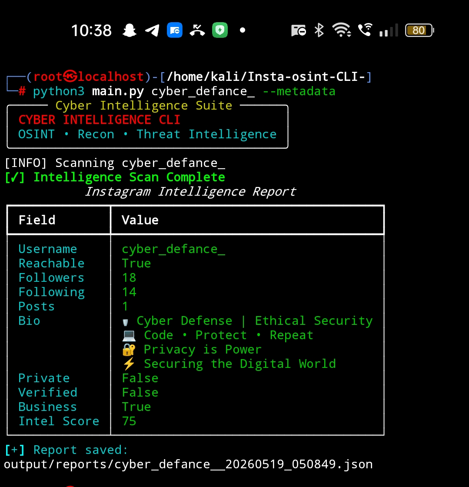
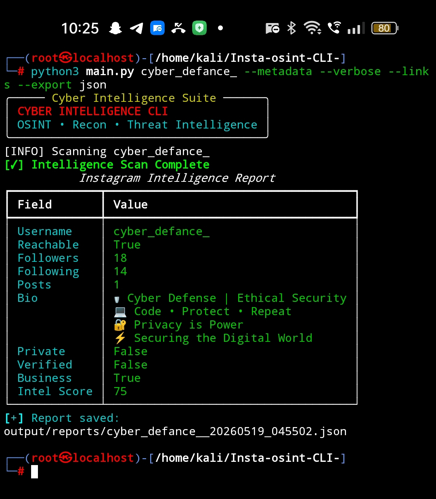

# Insta-OSINT CLI


Professional Instagram OSINT & Cyber Intelligence Toolkit built with Python.

---

## Community

[](https://whatsapp.com/channel/0029Vb6o1ejAjPXQi2KCAk1f)

[](https://t.me/cyber_recon_hub)

[](https://discord.gg/XJQmx3XP8)

---

## Features

✅ Public / Private Account Detection  
✅ Verified Badge Detection  
✅ Business Account Detection  
✅ Creator Account Detection  
✅ Followers / Following / Posts Parser  
✅ Instagram Bio Extraction  
✅ Metadata Intelligence  
✅ Username Intelligence  
✅ Keyword Analysis  
✅ Intelligence Scoring System  
✅ JSON Report Export  
✅ Rich Terminal Dashboard  
✅ Link Extraction Engine  

---

## Installation

Clone repository:

```bash
git clone https://github.com/naveen-anon/Insta-osint-CLI-.git
```

Move into project:

```bash
cd Insta-osint-CLI-
```

Install dependencies:

```bash
pip3 install -r requirements.txt
```

---

## Usage

Basic Scan:

```bash
python3 main.py username
```

Metadata Scan:

```bash
python3 main.py username --metadata
```

Full Intelligence Scan:

```bash
python3 main.py username --metadata --links --export json
```

Example:

```bash
python3 main.py cyber_defance_ --metadata --links --export json
```

---

## Output Example

```text
┌──(root㉿localhost)-[/home/kali/Insta-osint-CLI-]
└─# python3 main.py cyber_defance_ --metadata --verbose --links --export json
╭───── Cyber Intelligence Suite ──────╮
│ CYBER INTELLIGENCE CLI              │
│ OSINT • Recon • Threat Intelligence │
╰─────────────────────────────────────╯
[INFO] Scanning cyber_defance_
[✓] Intelligence Scan Complete
           Instagram Intelligence Report
┏━━━━━━━━━━━━━┳━━━━━━━━━━━━━━━━━━━━━━━━━━━━━━━━━━━━┓
┃ Field       ┃ Value                              ┃
┡━━━━━━━━━━━━━╇━━━━━━━━━━━━━━━━━━━━━━━━━━━━━━━━━━━━┩
│ Username    │ cyber_defance_                     │
│ Reachable   │ True                               │
│ Followers   │ 18                                 │
│ Following   │ 14                                 │
│ Posts       │ 1                                  │
│ Bio         │ 🛡️ Cyber Defense | Ethical Security │
│             │ 💻 Code • Protect • Repeat         │
│             │ 🔐 Privacy is Power                │
│             │ ⚡ Securing the Digital World      │
│ Private     │ False                              │
│ Verified    │ False                              │
│ Business    │ True                               │
│ Intel Score │ 75                                 │
└─────────────┴────────────────────────────────────┘
```

---

## Screenshots

## Metadata Intelligence Scan



---

## Full Intelligence Report



---

## Project Structure

```bash
Insta-osint-CLI-/
│
├── main.py
├── requirements.txt
├── LICENSE
├── README.md
│
├── core/
│   ├── banner.py
│   ├── cli.py
│   ├── logger.py
│
├── modules/
│   ├── profile_lookup.py
│   ├── metadata_parser.py
│   ├── profile_stats.py
│   ├── account_analyzer.py
│   ├── link_extractor.py
│   ├── username_intel.py
│   ├── keyword_analyzer.py
│   ├── score_engine.py
│   ├── display.py
│   ├── report_generator.py
│
├── assets/
│   ├── demo1.jpg
│   ├── demo2.jpg
│
└── output/
    └── reports/
```

---

## Tech Stack

- Python
- Requests
- BeautifulSoup4
- Rich

---

## Use Cases

- Public OSINT Research
- Instagram Reconnaissance
- Cyber Intelligence
- Username Intelligence
- Threat Investigation Workflows

---

## Disclaimer

This tool is designed only for:

- Publicly available information
- Authorized security research
- Educational purposes

Private account access, credential abuse, or privacy violations are not supported.

---

## License

This project is licensed under the MIT License.

---

## Author

Naveen | Cyber Recon Hub
