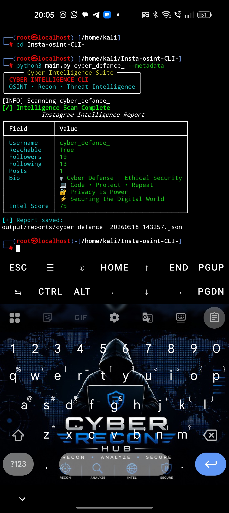

# Insta-OSINT CLI


[](https://whatsapp.com/channel/0029Vb6o1ejAjPXQi2KCAk1f)
Professional Instagram OSINT and cyber intelligence toolkit built with Python.

---

## Features

✅ Public Profile Detection  
✅ Metadata Extraction  
✅ Followers / Following / Posts Parser  
✅ Username Intelligence  
✅ Keyword Analysis  
✅ Intelligence Scoring  
✅ JSON Report Export  
✅ Colorful Terminal Dashboard  

---

## Installation

Clone repository:

```bash
git clone https://github.com/naveen-anon/Insta-osint-CLI-.git
```

Move into project:

```bash
cd Insta-osint-CLI-
```

Install dependencies:

```bash
pip3 install -r requirements.txt
```

---

## Usage

Basic scan:

```bash
python3 main.py username
```

Full intelligence scan:

```bash
python3 main.py username --metadata --links --export json
```

Example:

```bash
python3 main.py <username> --metadata --links --export json
```

---

## Project Structure

```bash
Insta-osint-CLI-/
├── main.py
├── requirements.txt
│
├── core/
│   ├── banner.py
│   ├── cli.py
│   ├── logger.py
│
├── modules/
│   ├── profile_lookup.py
│   ├── metadata_parser.py
│   ├── profile_stats.py
│   ├── link_extractor.py
│   ├── username_intel.py
│   ├── keyword_analyzer.py
│   ├── score_engine.py
│   ├── display.py
│   ├── report_generator.py
│
└── output/
```

---
## screenshots 
***full intelligence report***
## Metadata Intelligence Scan 




## Output Example

```text


┌──(root㉿localhost)-[/home/kali/Insta-osint-CLI-]
└─# python3 main.py cyber_defance_ --metadata
╭───── Cyber Intelligence Suite ──────╮
│ CYBER INTELLIGENCE CLI              │
│ OSINT • Recon • Threat Intelligence │
╰─────────────────────────────────────╯
[INFO] Scanning cyber_defance_
[✓] Intelligence Scan Complete
           Instagram Intelligence Report
┏━━━━━━━━━━━━━┳━━━━━━━━━━━━━━━━━━━━━━━━━━━━━━━━━━━━┓
┃ Field       ┃ Value                              ┃
┡━━━━━━━━━━━━━╇━━━━━━━━━━━━━━━━━━━━━━━━━━━━━━━━━━━━┩
│ Username    │ cyber_defance_                     │
│ Reachable   │ True                               │
│ Followers   │ 19                                 │
│ Following   │ 13                                 │
│ Posts       │ 1                                  │
│ Bio         │ 🛡️ Cyber Defense | Ethical Security │
│             │ 💻 Code • Protect • Repeat         │
│             │ 🔐 Privacy is Power                │
│             │ ⚡ Securing the Digital World      │
│ Intel Score │ 75                                 │
└─────────────┴────────────────────────────────────┘
[+] Report saved:
output/reports/cyber_defance__20260518_143257.json

```

---

## Use Cases
- Public OSINT research
- Social media reconnaissnce
- Username intelligence
- Cyber investigation orkflows
--
## Disclaim
This tool is designed only for:
- Publicly available infrmation
- Authorized securit research
- Educational purposes

Private account access, credential abuse, or privacy violation are ot supported.

---

## Author

Naveen | Cyber Recon Hub 
## License

This project is licensed under the MIT License.
